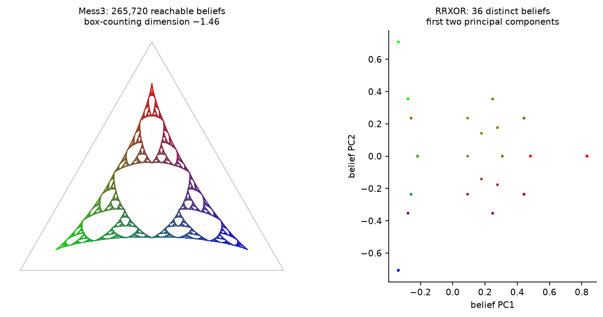
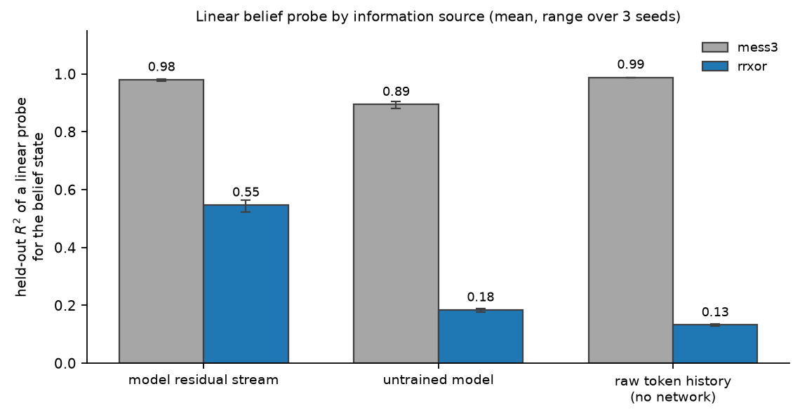
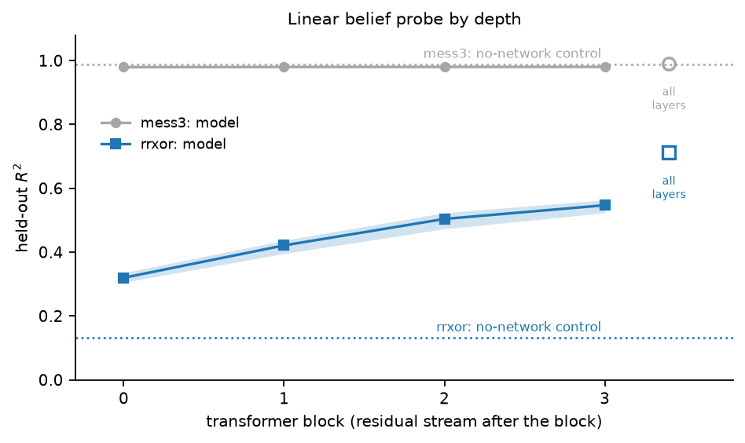

# Belief-state geometry in small transformers

A small, self-contained re-implementation of

> Shai et al., *Transformers Represent Belief State Geometry in their Residual Stream*, NeurIPS 2024
> ([arXiv:2405.15943](https://arxiv.org/abs/2405.15943))

written for learning and experimenting. It is not the authors' code and is not affiliated with
them; see the paper for the original work.

## What it does

A transformer trained only to predict the next token of a hidden Markov process should, if it is
optimal, track the Bayesian *belief state*: the posterior over the process's hidden states. This
repo

1. defines the processes (Mess3, RRXOR, Z1R) and computes their exact belief states and optimal loss,
2. trains a 4-layer, 64-wide transformer (201k parameters) from scratch on each process,
3. fits a linear probe from the residual stream to the belief state, and draws the recovered
   geometry next to the ground truth (for Mess3, a fractal in the probability simplex).

Everything runs locally in a few minutes on one GPU (or slowly on CPU); there are no downloads.



## Additions beyond the paper

- **Baselines for the probe.** Besides shuffled labels, the probe is compared with an untrained
  network and with a probe on the raw one-hot token history, no network at all. The last one asks
  how much of the belief is simply a linear function of the input.
- **Three seeds** per process, with ranges reported.
- **Depth profile** and a probe on **all layers concatenated**.

## Results

Held-out R², mean over three trained models:

| Process | Final layer | All layers | Untrained model | Token history (no network) |
|---|---|---|---|---|
| Mess3 | 0.980 | 0.992 | 0.895 | 0.988 |
| RRXOR | 0.547 | 0.712 | 0.184 | 0.132 |

- The Mess3 fractal is recovered (R² = 0.98), but a linear readout of the recent tokens recovers
  it just as well, and probe accuracy is flat across layers.
- For RRXOR, whose belief update needs an XOR, the token-history baseline fails (0.13) while the
  network reaches 0.55, rising with depth, and 0.71 when all layers are combined.




## Setup

```bash
git clone https://github.com/shouvik-majumder/belief-geometry.git
cd belief-geometry
conda create -n beliefgeom python=3.12 -y
conda activate beliefgeom
pip install torch --index-url https://download.pytorch.org/whl/cu128   # or the build for your system
pip install -r requirements.txt
```

## Usage

```bash
python scripts/00_process_check.py                        # sanity-check the probability machinery
python scripts/01_plot_msp.py --depth 11                  # ground-truth belief geometry
python scripts/02_train.py --n-steps 4000                 # train on Mess3 (add --seed N for more)
python scripts/02_train.py --process rrxor --seq-len 12 --n-steps 4000
python scripts/03_belief_geometry.py --ckpt data/checkpoints/mess3_L4_d64_seed0.pt
python scripts/04_summary_figures.py --force              # all figures; expects seeds 0-2 of both
```

## Layout

```
bg/process.py   hidden Markov processes, Bayes updates, optimal (myopic-entropy) loss
bg/msp.py       reachable belief states and their plotting projection
bg/model.py     transformer, training loop, activation capture
bg/probe.py     linear probes and the token-history baseline
scripts/        the steps above
```

## License

MIT; see [LICENSE](LICENSE).
